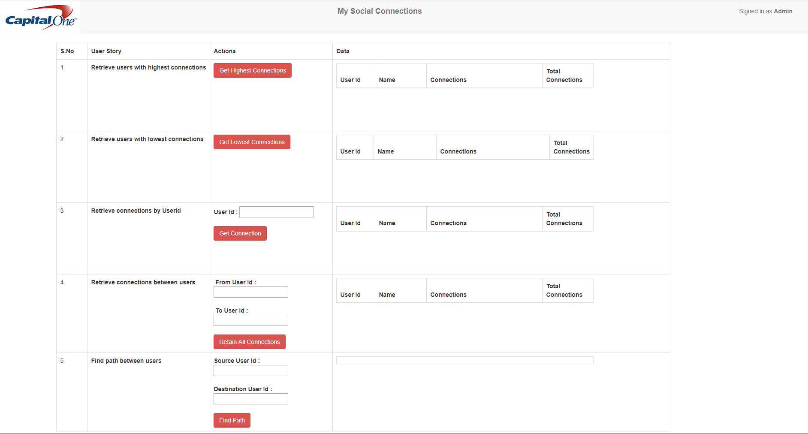

# Project Title

My Social Connect Application 

## High-Level Design Document
Download  - [High level design document](./documentation/01_High_Level_Design_SocialConnect_FINAL.docx)

## Getting Started

These instructions will get you a copy of the project up and run on your local machine to test. This application is developed using Spring Boot. You can run this application as a stand-alone Java application once all necessary software is installed and configured.

### Prerequisites

Before we begin, open a terminal and run the following commands to ensure that you have valid versions of Java and Maven installed

* Check the version of Java. Make sure JDK 10.0.2 is installed
```
C:\>java -version
```
Should Display

```
java version "10.0.2" 2018-07-17
Java(TM) SE Runtime Environment 18.3 (build 10.0.2+13)
Java HotSpot(TM) 64-Bit Server VM 18.3 (build 10.0.2+13, mixed mode)
```

* Check the version of Maven. Make sure Maven 3.5.4 is installed
```
C:\>mvn -v
```
Should Display

```
Apache Maven 3.5.4 (1edded0938998edf8bf061f1ceb3cfdeccf443fe; 2018-06-17T13:33:14-05:00)
Maven home: C:\Tools\apache-maven-3.5.4\bin\..
Java version: 10.0.2, vendor: Oracle Corporation, runtime: C:\Program Files\Java\jdk-10.0.2
Default locale: en_US, platform encoding: Cp1252
OS name: "windows 10", version: "10.0", arch: "amd64", family: "windows"
```

### Installing

Install Java, Maven, and Eclipse if it is not installed or does not have the correct version. You can download the same from below location


* [JDK-10](http://www.oracle.com/technetwork/java/javase/downloads/jdk10-downloads-4416644.html) - Install JDK
* [Maven](https://maven.apache.org/) - Dependency Management
* [Eclipse - Photon](https://www.eclipse.org/downloads/) -Eclipse IDE to ren and view the source code

```
Note: After installation, make sure to add Maven and JDK to the classpath.
```

## Setup

Clone the source code from GIT repository using below command

```
C:>git clone https://github.com/sandeep-papudesi/my-social-connect-api
```

### Importing the project to Eclipse IDE
* Import “my-social-connect-api” into your Eclipse IDE as an "Existing Maven Project"
* Right-click on the project select Maven-> Update Project to download all the dependencies

### Build from Source
* Invoke build command using command prompt at the root of the project or execute clean & install maven task in Eclipse IDE

```
c:>mvn clean install
```

### Running the app from Eclipse IDE
* Run it as Spring Boot App (SocialConnectBootStartApp.java)

### Running the app from terminal window
You can easily start the app as any other Spring Boot app. Navigate to installed location of the app

```
cd my-social-connect-api
C:>mvn spring-boot:run
```

### Usage
* Launch the application using URL: http://localhost:8080/
* You can see the content from the static page index.html



## Running the tests

Spring Boot automatically runs all the tests while we execute the application. We can manually unit test the code using "SocialConnectResourceTests.java" class

### Features enabled as part of unit testing

| S.No  | Feature  		| Test method to execute |
|-------| ------------- | -----------------------|
|   1   | Who can introduce Lucas(4) to Adam(id=62)  | Run testFindPath() method in SocialConnectResourceTests.java class  |
|   2   | How many connections are there between two users.  | Run testGetAllConnections() method in SocialConnectResourceTests.java class  |
|   3   | How many total connections  Lucas(id=4) has?  | Run testGetConnection() method in SocialConnectResourceTests.java class  |
|   4   | Which user has highest connections  | Run testGetMaxConnections() method in SocialConnectResourceTests.java class  |
|   5   | Which user has lowest connections | Run testGetMinConnections() method in SocialConnectResourceTests.java class  |

### Testing the REST Services
Below features are enabled as REST services. We can test the same using below URL 

| S.No  | Feature  		| REST service details|
|-------| ------------- | -----------------------|
|   1   | Who can introduce Lucas(4) to Adam(id=62)  |  http://localhost:8080/socialconnect/findpath/{source-id}/{dest-id}  |
|   2   | How many connections are there between two users.  | http://localhost:8080/socialconnect/{fromId}/{toId}  |
|   3   | How many total connections  Lucas(id=4) has?  | http://localhost:8080/socialconnect/{id}/  |
|   4   | Which user has highest connections  |  http://localhost:8080/socialconnect/max/  |
|   5   | Which user has lowest connections | http://localhost:8080/socialconnect/min/  |


### Acceptance Testing 
Acceptance testing report is available in below location
[Aceptance Testing](./documentation/04_Acceptance-Testing-Report.docx)

## Code Review and Analysis

### Static Code Analysis - SONARQUBE
Static code analysis is done using SONARQUBE and report is available
[Static Code Analysis](./documentation/02_Static-Code-Analysis.docx)

### Code Coverage - JACOCO
Code coverage is added as part of the build process. Access the report in my-social-connect-api/target/site/jacoco/index.html
Existing report can be downloaded from [Code Coverage Report](./documentation/03_code-coverage-jacoco.zip)
